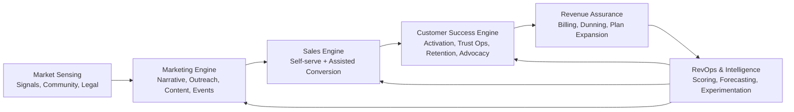

# Lore-Anchor GTM Architecture Report (Marketing / Sales / Customer Success)

## 0. Report Intent
このレポートは、以下2つの調査結果を統合し、Lore-AnchorのGTM（Go-To-Market）を「運用可能な全体アーキテクチャ」として定義する。

- `/Users/harukiuesaka/Downloads/Lore-Anchor 統合リサーチプロンプト実行.md`
- `/Users/harukiuesaka/Downloads/compass_artifact_wf-c765488e-297f-4d32-9878-e5fd07831a66_text_markdown.md`

本レポートの読者はAIを想定する。したがって、戦略論ではなく、実行系の構造と判断規則を優先して記述する。

## 1. Synthesis Summary
2レポートの結論は整合している。特に以下は共通の高信頼論点である。

1. 競合保護ツールは無料優勢であり、Lore-Anchorの有料化は「クラウド処理速度」「運用代行」「可視化された保護価値」で成立する。
2. JPとUSは同一の訴求で運用すると失敗する。USは価値観の明示が効き、JPは安全・丁寧・実務価値の提示が効く。
3. 初期成長は自動化ではなく、高解像度の手動運用がボトルネックと価値源泉の両方になる。
4. セキュリティ/保護プロダクトは価値が不可視になりやすく、可視化レポートがRetentionの中核になる。
5. Dunningと決済フォールバックの設計はRevenue防衛の最重要機能である。

一方、補正が必要な点もある。

1. 一部の数値は出典の確度が混在しており、意思決定では「方向性の証拠」と「財務前提に使う証拠」を分離すべき。
2. 既存出力にはWorkflow JSONの欠損断片があるため、実運用時はデータ契約を再定義する必要がある。
3. B2C中心の設計だが、将来のStudio/Teamプランを考えるとSalesレイヤーの明示が不足している。

## 2. Architecture Principles
Lore-AnchorのGTMは以下の設計原則に固定する。

1. `Trust-first`: まず信頼を作り、次に効率化する。
2. `Manual before automation`: 自動化は手動SOPが安定してから実装する。
3. `Dual-market operation`: JPとUSを同一ワークフローに混ぜない。
4. `Evidence-graded decisions`: 重要判断は証拠強度タグ付きで扱う。
5. `Invisible value must be surfaced`: 保護結果を可視化しない運用は禁止する。
6. `Revenue leakage control`: 決済失敗は専用フローで回収する。

## 3. System Overview (Business Architecture)



このアーキテクチャは、単一ファネルではなく「運用ループ」である。  
`RevOps & Intelligence` が全ドメインの意思決定を同期する制御面を担う。

## 4. Domain Architecture: Marketing

### 4.1 Marketing Objective
`反AI感情` ではなく `作品保護の実務価値` を核に、初期獲得と信頼形成を同時に実現する。

### 4.2 Marketing Subsystems

1. `Signal Intelligence`
   - 入力: X/Reddit/Bluesky/Pixiv/note/Discordの公開シグナル。
   - 出力: 週次のテーマクラスターと論点温度。
2. `Narrative Control`
   - JP向け: 保護の実務性、丁寧な説明、匿名性配慮。
   - US向け: クリエイター権利と価値侵害防止の明示。
3. `Contextual Outreach`
   - 手動DM/返信を中心に初期ユーザーを獲得。
   - テンプレート使用率を抑え、個別作品言及を義務化。
4. `Content & SEO`
   - ユースケース別LP、比較記事、保護解説、FAQを運用。
   - ロングテール意図クエリ中心でCV導線を最短化。
5. `Event & Partner`
   - JP: 同人/クリエイター現場への接点設計。
   - US: Artistコミュニティと展示会接点の設計。

### 4.3 Marketing Core Workflow (MKT-01)

1. コミュニティシグナルを毎日収集する。
2. 「困りごと」「怒り」「比較検討」の3カテゴリに分類する。
3. 市場別テンプレートではなく、市場別ルールで文面を作成する。
4. 対象者の最新投稿/作品に基づき個別文面を作る。
5. 送信前にスパム耐性チェックを行う。
6. 送信後はログを台帳へ記録する。
7. 返信の温度をスコアリングする。
8. `Sales` または `CS` へハンドオフする。

### 4.4 Marketing Guardrails

1. 量より文脈を優先する。
2. 攻撃的な反AI煽動をしない。
3. 出典不明の数値を広告コピーに使わない。
4. 反応率低下時はチャネルを切り替える。

## 5. Domain Architecture: Sales

### 5.1 Sales Objective
B2Cのセルフサーブを主軸に、`高意図ユーザー` と `チーム化兆候ユーザー` のみをアシストして転換率を最大化する。

### 5.2 Sales Model (Dual Lane)

1. `Lane A: Self-serve Sales`
   - Free → Creator/Proの自然転換。
   - プロダクト内Paywallと使用上限イベントで誘導。
2. `Lane B: Assisted Sales`
   - 兆候: 大量アップロード、共同利用、高頻度ログイン、法人ドメイン。
   - 対応: 15分導入相談、運用要件ヒアリング、プラン提案。

### 5.3 Sales Pipeline

1. `Lead`
2. `Activated User`
3. `PQL (Product Qualified Lead)`
4. `Expansion Candidate`
5. `Won/Lost`

### 5.4 PQL Rules (初期案)

1. 7日で保護処理回数が閾値以上。
2. 失敗再実行率が低く、利用継続が安定。
3. 保護レポート閲覧が継続している。
4. 紹介行動または共同利用兆候がある。

### 5.5 Sales Playbooks

1. `Usage-limit Upsell`
   - 制限90%到達時に提案。
2. `Speed-sensitive Offer`
   - 処理時間不満に対して上位プランの優先処理を提案。
3. `Team Expansion`
   - 複数メンバー利用兆候を検知しStudioを提案。

### 5.6 Sales Guardrails

1. 強制ロック型の課金誘導を乱用しない。
2. JPは丁寧説明、USは価値の即時明示を優先する。
3. 価格提示前に「失うリスク」ではなく「守れる価値」を先に示す。

## 6. Domain Architecture: Customer Success

### 6.1 CS Objective
`初回価値到達` と `継続価値の知覚` を設計し、不可視価値プロダクトのチャーンを防ぐ。

### 6.2 CS Subsystems

1. `Activation Concierge`
   - 初回セットアップと保護完了まで伴走。
2. `Trust Operations`
   - 人間制作の証跡確認、品質監査、誤判定ケア。
3. `Retention Rescue`
   - At-Risk検知と個別リエンゲージメント。
4. `Advocacy & Community`
   - スーパーリファラーの育成とVIP運用。
5. `Success Reporting`
   - 週次/月次の保護可視化レポート配信。

### 6.3 CS Core Workflow (CS-RET-01)

1. At-Riskアラートを日次で受信する。
2. 行動ログと直近サポート履歴を確認する。
3. 離脱理由仮説を立てる。
4. 個別メッセージを作成する。
5. 必要なら処理代行を提案する。
6. 再開後の体験を確認する。
7. フィードバックを分類する。
8. Product/Marketing/Salesへ返す。

### 6.4 CS Guardrails

1. 定型文の大量送信を禁止する。
2. 返信遅延のSLAを定義し厳守する。
3. 苦情の温度が高いケースは即時エスカレーションする。
4. 「守られている実感」をUIとレポートの両方で提供する。

## 7. Cross-Domain Control Plane (RevOps)

### 7.1 Canonical Objects

1. `Person`
2. `Account`
3. `Workspace`
4. `ImageAsset`
5. `ProtectionJob`
6. `TrustReview`
7. `Conversation`
8. `Opportunity`
9. `Subscription`
10. `PaymentIncident`
11. `ReferralEvent`
12. `HealthScore`

### 7.2 Event Taxonomy

1. `acq.signal_detected`
2. `acq.outreach_sent`
3. `acq.reply_received`
4. `act.first_upload`
5. `act.first_protection_completed`
6. `act.trust_review_completed`
7. `ret.health_dropped`
8. `ret.recovery_contacted`
9. `ref.invite_sent`
10. `ref.invite_converted`
11. `rev.payment_failed`
12. `rev.payment_recovered`
13. `rev.plan_upgraded`

### 7.3 Handoff Contracts

| from | to | trigger | required_payload | sla |
| --- | --- | --- | --- | --- |
| Marketing | Sales | `acq.reply_received` かつ高意図 | market, pain, channel, conversation_context | 24h |
| Marketing | CS | `act.first_upload` 前相談 | user_profile, concern_type, urgency | 24h |
| Sales | CS | `rev.plan_upgraded` | plan, expectation, use_case, risk_flags | 12h |
| CS | Sales | 拡張兆候検知 | usage_growth, team_signal, value_gap | 48h |
| CS | Product | 反復フリクション検知 | repro_steps, impact_count, segment | 72h |
| Billing | CS | `rev.payment_failed` | payment_method, failure_code, ltv_band | same day |

## 8. KPI Architecture (North-star and Domain KPIs)

### 8.1 North-star
`Protected Value Realization Rate`  
= 「保護対象画像のうち、利用者が価値を認知し継続利用に至った割合」

### 8.2 Marketing KPIs

1. 高意図会話率
2. アウトリーチ返信率
3. サインアップ転換率
4. 市場別獲得効率（JP/US）

### 8.3 Sales KPIs

1. PQL化率
2. Free→Paid転換率
3. Upsell成約率
4. 有料化までの日数

### 8.4 CS KPIs

1. 初回価値到達時間（TTV）
2. 30/60/90日継続率
3. At-Risk回復率
4. サポート満足度

### 8.5 Revenue KPIs

1. MRR
2. NRR
3. Involuntary Churn率
4. Dunning回収率

## 9. JP/US Operating Split

| dimension | JP | US |
| --- | --- | --- |
| メッセージ | 丁寧、機能価値、実務保護 | 権利保護、価値侵害防止、立場明確化 |
| 導線 | 情報密度高め、説明重視 | 迅速、簡潔、セルフサーブ重視 |
| 口コミ | 匿名圏で静かな拡散 | 公開推薦と明示的拡散 |
| 決済 | カード+コンビニ+振込フォールバック | カード中心で自動回収最適化 |
| CS | 先回り支援 | 迅速応答と解決の透明性 |

## 10. Risk and Governance Architecture

### 10.1 Strategic Risks

1. 単一メッセージの国際展開による反発。
2. 手動審査のスケール限界。
3. 保護技術の回避手法進化。
4. 決済失敗による収益漏れ。
5. コミュニティ運営の不公平認知。

### 10.2 Governance Controls

1. 市場別メッセージ承認フロー。
2. 手動審査の品質監査サンプリング。
3. 週次の脅威アップデートレビュー。
4. Dunningテンプレートの法務/ブランド審査。
5. VIP選定基準の公開。

## 11. AI-Operable Org Blueprint

### 11.1 Role Topology (Human + AI)

1. `GTM Commander`  
   - 目標設定、優先順位、例外承認。
2. `Market Intelligence Agent`  
   - シグナル収集と論点クラスタリング。
3. `Narrative Agent`  
   - 市場別コピー草案生成。
4. `Outreach Agent`  
   - 候補抽出と下書き作成。送信は人間承認。
5. `PQL Scoring Agent`  
   - Salesハンドオフ判定。
6. `CS Copilot`  
   - At-Risk対応文面と次アクション提案。
7. `Billing Recovery Agent`  
   - 決済失敗の優先度付けと回収フロー提案。
8. `RevOps Auditor`  
   - KPI監査、矛盾検知、運用ルール逸脱検知。

### 11.2 Authority Boundaries

1. 送信、課金、返金、BANは必ず人間承認。
2. AIは提案生成と優先順位づけに限定。
3. 高リスク文面は二重承認を必須化。

## 12. 180-Day Rollout Architecture

### 12.1 Phase 1 (Day 0-30)

1. Canonical ObjectsとEvent Taxonomyを実装。
2. Marketing/CSの手動SOPを固定。
3. JP/USのコピーガイドラインを分離。
4. Dunningの手動回収フローを稼働。

### 12.2 Phase 2 (Day 31-90)

1. PQLスコアリングを運用開始。
2. 週次保護レポートを本番運用。
3. Referral台帳とVIP運用を開始。
4. 主要KPIのダッシュボードを稼働。

### 12.3 Phase 3 (Day 91-180)

1. 手動高負荷タスクを段階的に半自動化。
2. Assisted SalesをStudio候補へ展開。
3. Dunning回収の市場別最適化を反復。
4. GTMループの運用監査を月次で固定化。

## 13. Machine-Readable Architecture Spec (YAML)

```yaml
report_version: "1.0"
product: "Lore-Anchor"
stage: "Private Beta"
markets:
  - JP
  - US
domains:
  marketing:
    objective: "high-intent acquisition with trust-first narrative"
    subsystems:
      - signal_intelligence
      - narrative_control
      - contextual_outreach
      - content_seo
      - event_partner
    core_events:
      - acq.signal_detected
      - acq.outreach_sent
      - acq.reply_received
    slas:
      outreach_first_response: "within 12h"
      handoff_to_sales: "within 24h"
  sales:
    objective: "maximize free-to-paid and expansion conversion"
    lanes:
      - self_serve
      - assisted
    stages:
      - lead
      - activated_user
      - pql
      - expansion_candidate
      - won_lost
    core_events:
      - rev.plan_upgraded
    slas:
      pql_contact: "within 24h"
  customer_success:
    objective: "reduce TTV and prevent silent churn"
    subsystems:
      - activation_concierge
      - trust_operations
      - retention_rescue
      - advocacy_community
      - success_reporting
    core_events:
      - act.first_upload
      - act.first_protection_completed
      - ret.health_dropped
      - ret.recovery_contacted
    slas:
      at_risk_outreach: "within 1 business day"
  revenue_assurance:
    objective: "prevent involuntary churn and stabilize MRR"
    subsystems:
      - billing_monitoring
      - dunning_orchestration
      - payment_fallback
    core_events:
      - rev.payment_failed
      - rev.payment_recovered
    slas:
      first_dunning_contact: "within 24h"
control_plane:
  canonical_objects:
    - person
    - account
    - workspace
    - image_asset
    - protection_job
    - trust_review
    - conversation
    - opportunity
    - subscription
    - payment_incident
    - referral_event
    - health_score
  handoff_contracts:
    - from: marketing
      to: sales
      trigger: acq.reply_received
      required_payload: [market, pain, channel, conversation_context]
      sla: "24h"
    - from: billing
      to: customer_success
      trigger: rev.payment_failed
      required_payload: [payment_method, failure_code, ltv_band]
      sla: "same_day"
kpi_tree:
  north_star: protected_value_realization_rate
  marketing: [high_intent_conversation_rate, outreach_reply_rate, signup_conversion_rate]
  sales: [pql_rate, free_to_paid_conversion_rate, upsell_close_rate, days_to_paid]
  customer_success: [ttv, retention_30_60_90, at_risk_recovery_rate, csat]
  revenue: [mrr, nrr, involuntary_churn_rate, dunning_recovery_rate]
governance:
  approval_required_actions:
    - outbound_send
    - billing_change
    - refund_execution
    - user_ban
  risk_controls:
    - market_specific_message_review
    - trust_review_quality_sampling
    - monthly_threat_update_review
    - dunning_template_legal_check
```

## 14. Final Recommendations

1. まず「全自動化」ではなく「高信頼SOP化」を完了させる。
2. SalesをB2C補助機能として設計し、PQLと拡張候補だけに人手を集中する。
3. CSをコストセンターではなく、製品価値可視化の中核として配置する。
4. JP/US分岐を運用レイヤーで固定し、単一メッセージ運用を禁止する。
5. Dunningと支払いフォールバックをRevenueアーキテクチャの最上位に置く。

